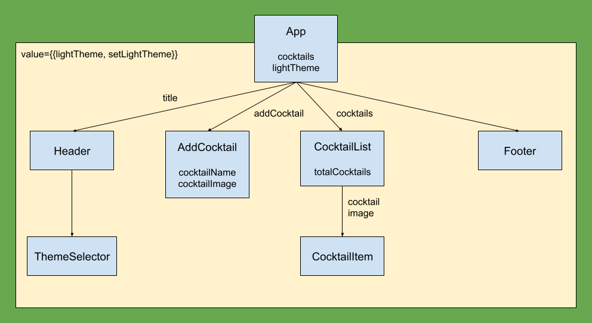

# 1. Instalación, arquitectura y JSX

- [Prerrequisitos](#prerrequisitos)
- [Primera SPA con React](#primera-spa-con-react)
- [Arquitectura por componentes](#arquitectura-por-componentes)
- [Renderizado condicional](#renderizado-condicional)

## Prerrequisitos

- Navegador Web: Chrome, Firefox, Edge, etc.
- Extensión React DevTools: [Chrome](https://chrome.google.com/webstore/detail/react-developer-tools/fmkadmapgofadopljbjfkapdkoienihi)
- Consola/Terminal: PowerShell, Git Bash, etc.
- Visual Studio Code: [https://code.visualstudio.com/](https://code.visualstudio.com/)
- Node.js / npm: [https://nodejs.org/es/download](https://nodejs.org/es/download)
- Git: [https://git-scm.com/download/](https://git-scm.com/download/)

## Primera SPA con React

### ¿Qué es una SPA?

Una Single Page Application (aplicación de página única) es aquella que no presenta recarga de página. Está normalmente asociada a un modelo de Client-Side Rendering, a diferencia de las MPA (Multi Page Application), normalmente implementadas bajo Server-Side Rendering.

En una SPA, se hace una primera carga de estáticos que implementan una lógica de presentación que se interpreta del lado del cliente, construyendo las vistas dinámicamente en frontend en lugar de pedirlo a backend, solicitando a este solamente aquellos datos que alimentan dichas vistas.

Como ventajas, da una mejor experiencia de usuario y ofrece un mejor rendimiento general de la aplicación, aliviando considerablemente la carga de trabajo en el servidor. Como desventajas, motiva al aprendizaje de alguna librería o framework ya que hacerlo en VanillaJS puede llegar a ser muy tedioso.

### ¿Qué es React?

- Es una **librería de desarrollo** de aplicaciones web **frontend**, basada en una **arquitectura por componentes de tipo árbol**.
- Compite con frameworks como Angular o Vue como otras tecnologías de desarrollo frontend, si bien han surgido frameworks basados en React como Next.js, Remix o Gatsby.
- Una **librería** es un conjunto de funciones ya predefinidas y listas para su uso, lo que da más flexibilidad a la hora de tomar decisiones propias, pero menos recursos de base, que hay que complementar si surgen necesidades no cubiertas por dichas funciones.
- Un **framework** es un conjunto de técnicas con una cierta estructura y normas de uso preestablecidas, lo que ofrece más versatilidad de cara a abordar cualquier casuística, pero también supone la imposición de más restricciones y un coste de aprendizaje mayor.

### Hola Mundo en React

1. Crear la aplicación:

  - Método 1:
    
        npx create-react-app hello-world
  
  - Método 2:
    
    (Solo la primera vez)

        npm install --global create-react-app
    
    (Para cada proyecto)

        create-react-app hello-world

2. Modificar el fichero `hello-world/src/App.js`:

    ```jsx
    import './App.css'

    const App = () => {
      return (
        <div className="App">
          <h1>Hola Mundo</h1>
        </div>
      )
    }

    export default App
    ```

3. Lanzar la aplicación:

        cd hello-world
        npm start

## Ejemplo de arquitectura por componentes



## Renderizado condicional

React utiliza una extensión de JavaScript llamada JSX, que permite definir de manera intercalada la lógica de presentación con los contenidos HTML a renderizar.

Todo componente de React devuelve el código JSX que la librería preprocesará antes de transpilarlo a HTML estándar, generando el código final que enviar al navegador.

Esto quiere decir que es posible leer valores almacenados en memoria o aplicar estructuras de control de flujo para la construcción de los elementos y contenidos HTML:

```jsx
const Spoiler = () => {
  const hidden = true
  const synopsis = 'Va de unos que se hacen ceros y lo niegan todo'
  const score = 9

  return (
    <div>
      <p>{ hidden ? 'Spoiler alert' : synopsis }</p>

      { score > 8 && <p>Está mu bien, tienes que verla</p> }
    </div>
  )
}
```
