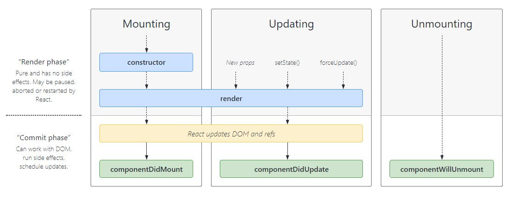
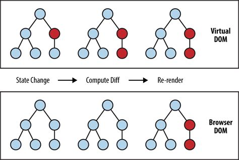
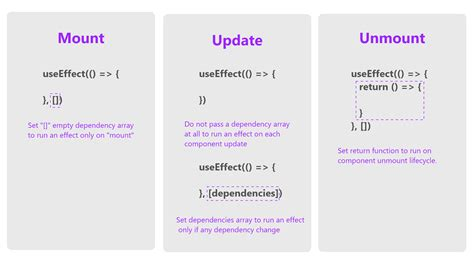

# 4. Cuestiones de diseño, ciclo de vida y asincronía

- [Cuestiones de diseño](#cuestiones-de-diseño)
- [Ciclo de vida](#ciclo-de-vida)
- [Asincronía](#asincronia)

## Cuestiones de diseño

A la hora de diseñar la arquitectura de la aplicación, esta debe presentarse como una consecuencia del wireframes a implementar.

Para ello, cabe preguntarse:

1. ¿Qué componentes necesito para implementar el wireframes y qué relación tienen entre ellos?
2. ¿Qué información (estados y funciones auxiliares propias) debe guardar y mantener cada componente?
3. ¿Qué información debe recibir y transmitir cada componente (via `props`, `context`, etc.)?

## Ciclo de vida

Además, es conveniente tener en cuenta el ciclo de vida de los componentes, cuyas tres fases son:

1. Montado
2. Actualización
3. Desmontado



Siguiendo el paradigma de la programación reactiva, esta es la secuencia de acciones que React desarrolla:

1. Cambian los datos observados (estados, `props`, etc.)
2. React se entera de eso y reacciona, preguntándose:
    - ¿Qué había antes del cambio de los datos en la vista?
    - ¿Qué tiene que haber después del cambio de los datos?
3) Compara entre ambos estados
4) Decide qué hacer con el árbol DOM: crear nodos, borrar nodos, modificar propiedades, etc.

Para ello se apoya en el Virtual DOM:



## Asincronía

En React los llamados **side effects** (peticiones a servidor remoto via `Fetch API`, temporizadores, operaciones con ficheros, etc.), que normalmente en VanillaJS se manejan mediante promesas (o su variante `async-await`) deben manejarse con el hook `useEffect`, que presenta 3 casos de uso, además de una característica extra para operaciones de limpieza:

- **Fase 1 (Montado)**: Cuando se carga la primera vez:

  ```jsx
  useEffect(() => {
    // ...
  }, [])
  ```

- **Fase 2.1 (Actualización genérica)**: En cualquier actualización, incluida la primera:

  ```jsx
  useEffect(() => {
    // ...
  })
  ```

- **Fase 2.2 (Actualización específica)**: En cualquier actualización, incluida la primera, de las dependencias especificadas (`props`, estados, etc.):

  ```jsx
  useEffect(() => {
    // ...
  }, [dep])
  ```

- **Fase 3 (Desmontado)**: Al retirar el componente de la vista (por ejemplo, al definir el montado):

  ```jsx
  useEffect(() => {
    // ...

    return () => {
      // ...
    }
  }, [])
  ```

De este modo, el ciclo de vida expresado para componentes funcionales queda de la siguiente manera:


