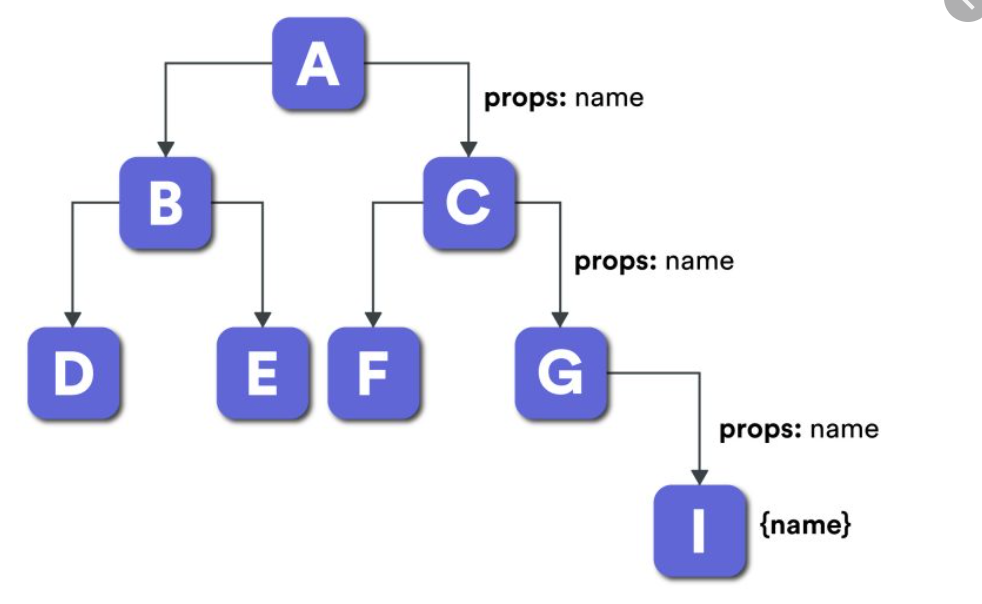

# 5. Context y Enrutamiento

- [Context](#context)
- [Enrutamiento](#enrutamiento)

## Context

Cuando la aplicación crece, la arquitectura de componentes aumenta en consecuencia. Esto puede originar fácilmente un problema de `prop drilling`.



Para evitar esto, la librería provee del concepto de Context, que habilita un canal directo entre un componente y sus sucesores, de manera que el primero actúa como proveedor del dato y los segundos como consumidores.

Ejemplo de implementación:

1. Canal de comunicación ( `contexts/Theme.js` ):

    ```jsx
    import { createContext } from 'react'

    export const ThemeContext = createContext()
    ```

2. Proveedor ( `App.js` ):

    ```jsx
    const App = () => {
      const [theme, setTheme] = useState(true)

      // ...

      return (
        <div className="App">
          <ThemeContext.Provider value={{theme, setTheme}}>
            // ...
          </ThemeContext.Provider>
        </div>
      )
    }
    ```

3. Consumidor ( `components/ThemeSelector.js` ):

    ```jsx
    import { useContext } from 'react'
    import { ThemeContext } from '../contexts/Theme'

    import lightIcon from './day.png'
    import darkIcon from './night.png'
    
    const ThemeSelector = () => {
      const {theme, setTheme} = useContext(ThemeContext)

      return (
         setTheme(!theme)}
        />
      )
    }
    ```

## Enrutamiento

En una SPA, además de dotarla una navegación entre las distintas vistas que no implique una recarga de página, es posible y conveniente implementar una asociación entre dichas vistas y las rutas en la barra de direcciones del navegador.

Para el caso de React, dado que la librería no trae un sistema de enrutamiento propio, una buena opción es utilizar React Router. Para ello, los pasos a seguir son los siguientes:


1. Instalar paquete:

        npm i react-router-dom

2. Modificar el fichero `index.js`:

    ```jsx
    import { BrowserRouter } from 'react-router-dom'

    ...

    root.render(
      <BrowserRouter>
        <App />
      </BrowserRouter>
    )
    ```

3. Asociar las rutas a elementos renderizables:

    ```jsx
    import { Routes, Route } from 'react-router'

    ...

    <Routes>
      <Route path="/" element={<Home />} />
      <Route path="dashboard" element={<Dashboard />} />
    </Routes>
    ```

4. Asociar los elementos de navegación a las rutas:

    ```jsx
    import { Link } from 'react-router'

    ...

    <nav>
      <Link to="/">Inicio</Link>
      <Link to="/settings">Configuración</Link>
    </nav>
    ```
