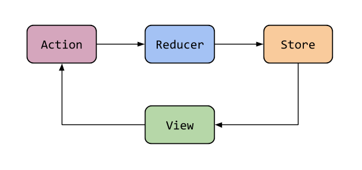
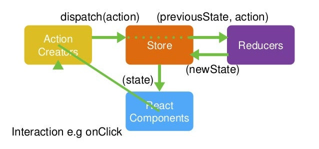

# 6. Redux

- [Descripción y motivación](#descripcion-y-motivacion)
- [Instalación y entorno](#instalacion-y-entorno)
- [Arquitectura del patrón](#arquitectura-del-patron)
- [Middlewares](#middlewares)

## Descripción y motivación

.

## Instalación y entorno

- Creación del proyecto
- DevTools

## Arquitectura del patrón

- Stores
- Actions
- Reducers
- Componentes

## Middlewares

- Thunks
- Slices

### Flujo básico

### Flujo detallado

### Arquitectura

## Referencias

- [Primeros pasos](https://redux.js.org/introduction/getting-started)
- [Tutorial Redux](https://www.neoguias.com/tutorial-redux/)
- [Redux Thunk](https://www.freecodecamp.org/news/redux-thunk-explained-with-examples/)
- [Tutorial Redux con Thunk](https://www.digitalocean.com/community/tutorials/redux-redux-thunk-es)